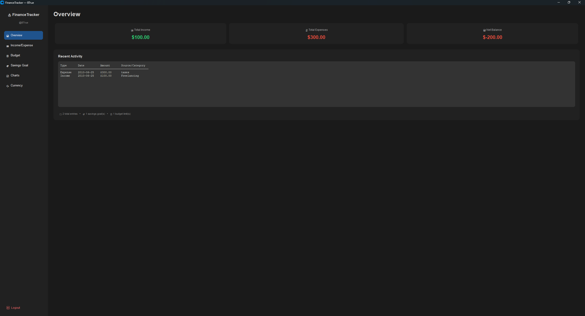

# Personal Finance Project
***

Our personal finance project uses a GUI (using custom Tkinter) with a main menu
where you can use various widgets to do different tasks. These tasks include managing income and expenses,
budgeting, making savings goals, currency converter, and a charts display. All of the information is then saved in
a CSV file.

## How to use
***
1. Run project.
2. If libraries aren't installed the program will automatically download them.
3. Use the menu to use different widgets.
4. Exit by clicking the X in the program screen.

## Details on Project features
***
- Classes
- Functions
- CSV files
- Custom Tkinter
- Password hashing

## Lisence
***
Anything made for school has no copyright

## Contributors
- Douglas London
- True Eggleston
- Isabella Cowdell